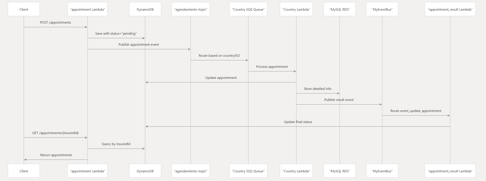
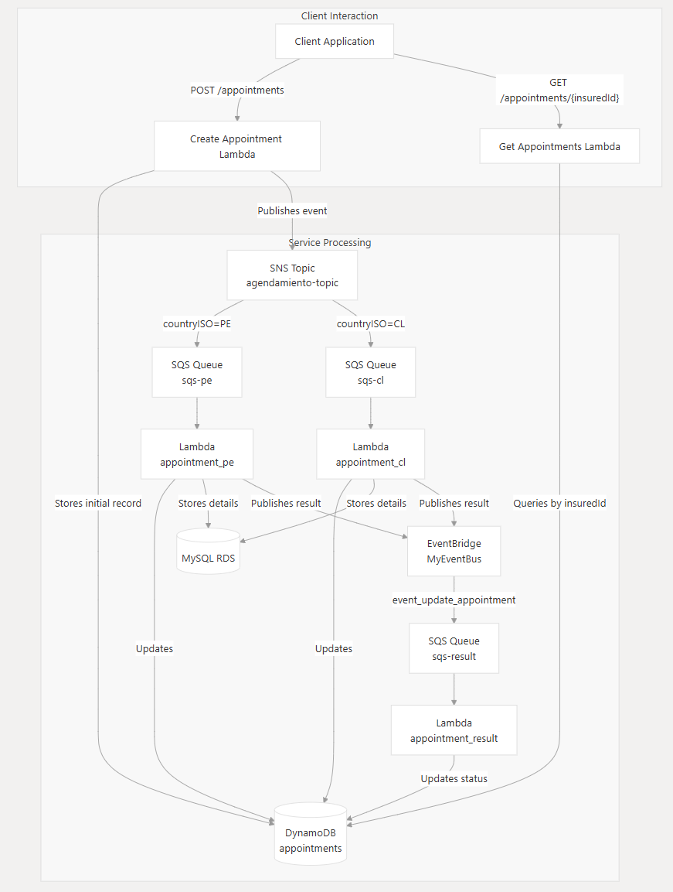

# Service Appointment Management System

## Overview
This project provides a robust service appointment management solution built as a serverless application using AWS Lambda and DynamoDB. It allows users to create and view service appointments through a RESTful API.

## Features
- Appointment scheduling
- Get Appointments by insuredId
- Responsive design for various device sizes
- Real-time updates

## Technology Stack
### Backend
- AWS Lambda
- Amazon DynamoDB
- TypeScript
- Serverless Framework
- MySQL (with mysql2 package)
- Zod for schema validation
- AWS SDK

### Testing & Development
- Jest for testing
- Serverless Offline for local development
- TypeScript
- ESBuild for bundling


## Getting Started

### Prerequisites
- Node.js (v18.x or higher)
- npm (v6.x or higher)
- AWS CLI configured with appropriate credentials
- Serverless Framework CLI

### Installation

1. Clone the repository:
   ```bash
   git clone https://github.com/yourusername/service-appointment.git
   cd service-appointment
   ```

2. Install dependencies:
   ```bash
   npm install
   ```

3. Run:
   ```bash
   npm run deploy:dev
   ```

### Deployment

Deploy to AWS:
```bash
npm run deploy
```

Or specifically to the dev environment:
```bash
npm run deploy:dev
```

Remove deployed services:
```bash
npm run remove
```

## API Endpoints
The service exposes the following endpoints (actual paths will depend on your Serverless configuration):

- `GET /appointments/{id}` - Get appointment by ID
- `POST /appointments` - Create a new appointment
- `GET /swagger` - Get document API

## Testing
Run the test suite with:
```bash
npm test
```
## Workflow



The above diagram shows the complete workflow of the service appointment system, from user request to service completion.

## System Architecture Overview



The Appointment Service follows a serverless, event-driven architecture pattern leveraging several AWS services. This design enables scalability, fault tolerance, and country-specific processing logic.
